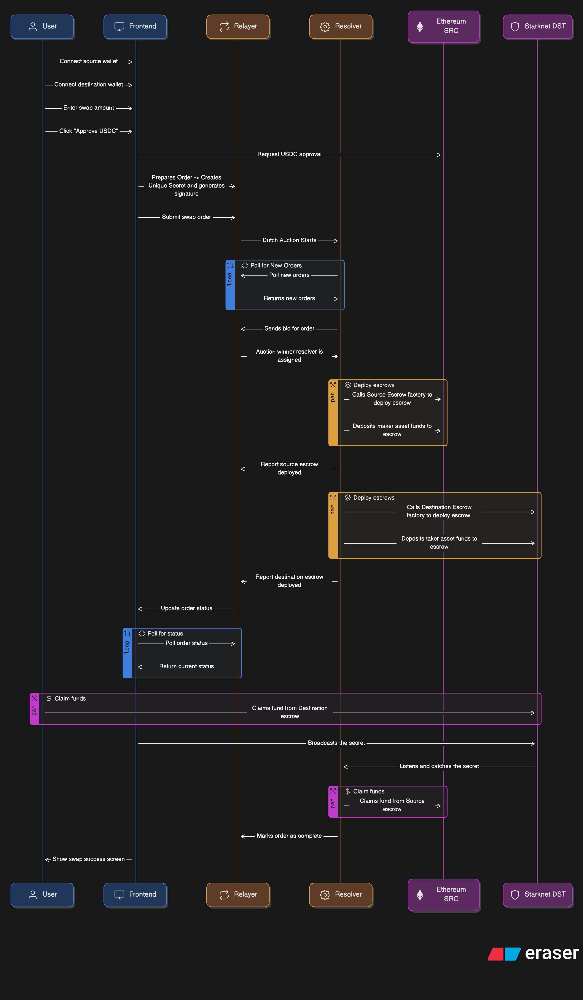

# MultiZap ⚡

**MultiZap** is an extension of [1inch Fusion+](https://1inch.io/fusion/) enabling **cross-chain atomic swaps** between Ethereum and Starknet via a Dutch auction mechanism and HTLC-based trustless relayers.

This system utilizes smart contracts, relayers, and resolvers to enable secure, decentralized, and efficient ERC20 asset swaps across EVM and Starknet chains.

---

## 🧠 Key Features

- ⚖️ **Dutch Auction-based Resolver Selection**  
  Resolver selection is handled off-chain using a Dutch auction model to ensure optimal pricing and competitive execution.

- 🔁 **Atomic Swaps using HTLC across Ethereum and Starknet**  
  Ensures trustless cross-chain execution using hash-locked and time-locked escrow contracts.

- 🧩 **Modular and Pluggable Architecture**  
  Decoupled components — UI, smart contracts, relayer, and resolver — can be independently upgraded and extended.

- ⛽️ **Gas-Efficient and Secure Escrow Contracts**  
  Lightweight HTLC implementations for both EVM (Solidity) and Starknet (Cairo 1.0).

- 📡 **Built-in Monitoring and Finalization**  
  Resolver and relayer monitor order lifecycle and enable reliable claiming and order completion workflows.


## 📊 Architecture

This is a high-level architecture and flow for a typical swap lifecycle:



**Flow:**
1. User initiates swap from EVM to Starknet.
2. Dutch auction is started to select a resolver.
3. Resolver deposits funds into escrows on both chains.
4. HTLC logic ensures secret revelation and atomicity.
5. User and resolver claim funds from respective escrows.

---

## 🗂 Folder Structure

### `/frontend`

- A React-based web interface for users to initiate and monitor cross-chain swaps.
- Includes:
  - Wallet connection (both EVM and Starknet)
  - Order creation
  - Polling for order status
  - Claim UI
  - Interaction with contracts and relayer endpoints

### `/relayer`

- **Node.js service** that acts as the **coordinator** and **order manager**.
- Responsibilities:
  - Manages and stores **swap orders** submitted by users.
  - Hosts **REST APIs** for:
    - Submitting new orders.
    - Fetching open/pending/complete orders.
    - Polling status updates.
  - Runs and manages the **Dutch auction** lifecycle:
    - Accepts bids from resolvers.
    - Picks the winning bid.
    - Broadcasts assignment of the resolver.
  - Tracks and updates order status throughout the swap process.


### `/resolver`

- **Off-chain agent (bot)** that actively participates in fulfilling swap orders.
- Responsibilities:
  - **Monitors the relayer** for new auction opportunities by polling open orders.
  - **Computes and submits bids** during the Dutch auction phase.
  - On winning an auction:
    - **Deploys HTLC escrows** on both EVM and Starknet.
    - **Deposits funds** into both escrows based on order details.
  - **Monitors secret broadcasts**, listens for claims, and ensures correct settlement.
  - **Broadcasts the secret** after claiming to enable atomic completion.
  - Updates order status by interacting with the relayer.

> The resolver is *chain-aware* and handles all interactions with EVM and Starknet smart contracts for fulfilling the cross-chain swap.

### `/evm_htlc`

- Contains Solidity smart contracts:
  - **HTLCEscrowFactory.sol**: Factory to deploy individual escrows.
  - **HTLCEscrow.sol**: Standard HTLC escrow contract with `claim()` and `refund()` methods.
- Also includes deployment scripts and tests.

### `/starknet_htlc`

- Cairo contracts for Starknet:
  - Equivalent escrow logic mirroring EVM contracts.
  - Uses Starknet-compatible HTLC conditions.
- Built for deployment via `starkli` or `sncast`.

---

## 🧾 Contract Addresses

| Chain            | Contract                        | Address                      |
|------------------|---------------------------------|------------------------------|
| Ethereum Sepolia | HTLCEscrowFactory               | [Sepolia HTLC Factory](https://sepolia.etherscan.io/address/0xfaa252aa73e36216de5a30adebc4f5902cd713f3)        |
| Ethereum Sepolia | USDC                            | [USDC](https://sepolia.etherscan.io/token/0x7dda7fbe5cc89791791c284e0c55c6c7b75631fa)                       |
| Starknet Sepolia | StarknetEscrowFactory           | [Starknet HTLC Factory](https://sepolia.voyager.online/contract/0x01248c99473439e9e79518adff2ba5e645122591571f096f8f6cc003cc0d4d9a)        |
| Starknet Sepolia | USDC                            | [USDC](https://sepolia.voyager.online/contract/0x02b2907cf7c978abfd26bd8e92204ba7303743ba5a7107ca7012dace168ab0cf)        |

---

## 🚀 Getting Started

### Prerequisites

- [Node.js](https://nodejs.org/) (v22+ recommended)
- [Foundry](https://book.getfoundry.sh/) (`forge` for EVM smart contracts)
- [Starkli](https://book.starknet.io/docs/cli/starkli/) or [Sncast](https://github.com/keep-starknet-strange/sncast) (for Starknet deployments)
- [Docker](https://www.docker.com/) *(optional, for containerizing relayer/resolver)*
- Wallets:
  - **EVM:** Metamask
  - **Starknet:** ArgentX or Braavos


### 1. Clone the Repo

```bash
git clone https://github.com/0xNilesh/MultiZap.git
cd MultiZap
```

### 2. Setup and Run Frontend

```bash
cd frontend
npm install
npm run dev
```

### 3. Setup and Run Relayer

```bash
cd relayer
npm install
npm run dev
```

### 4. Setup and Run Resolver

```bash
cd resolver
npm install
npm run dev
```

### 5. Deploy Contracts

EVM contracts
```bash
cd evm_htlc
forge build
forge script script/deploy.s.sol \
  --rpc-url <SEPOLIA_RPC_URL> \
  --private-key <PRIVATE_KEY> \
  --broadcast
```

Starknet Contracts
```bash
cd starknet_htlc
starkli declare ...
starkli deploy ...
```

## 🤝 Contributing
PRs and issues are welcome. Please create a feature branch and submit a pull request with relevant details.

## 📄 License
MIT License © 0xNilesh
